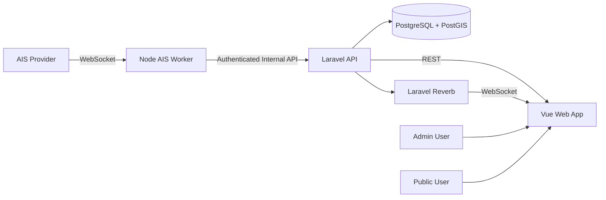
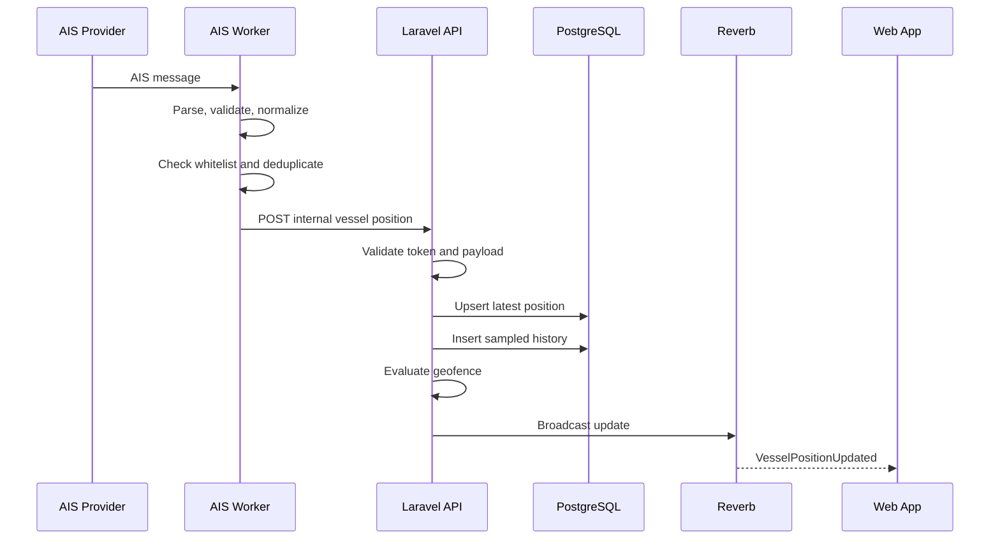
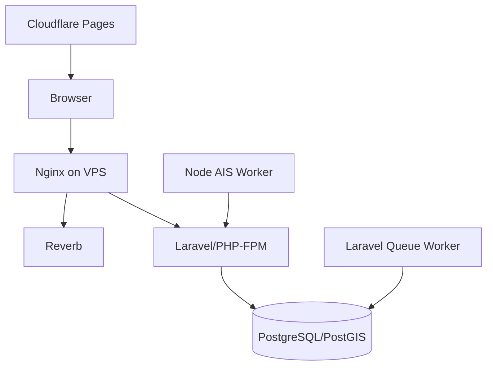

# 04 — System Architecture

## 1. Arsitektur Tingkat Tinggi

## 2. Komponen

### Frontend

- Public map.
- Search dan vessel detail.
- Admin dashboard.
- Realtime client.

### Backend

- Public API.
- Admin API.
- Internal worker API.
- Vessel registry service.
- Position service.
- Geofence service.
- Event broadcasting.

### Worker

- Provider connection.
- Subscription.
- Validation.
- Normalization.
- Whitelist cache.
- Deduplication.
- Delivery retry.

### Database

- Master data.
- Latest position.
- History.
- Geofence events.
- Sources dan evidence.
- Audit logs.

## 3. Data Flow Posisi

## 4. Trust Boundaries

- Provider AIS adalah external untrusted input.
- Worker adalah semi-trusted service.
- Internal API tetap harus memvalidasi semua payload.
- Browser tidak pernah menerima secret provider.
- Admin operations membutuhkan authentication dan authorization.

## 5. Deployment Awal

## 6. Scaling Path

### Fase 1

Semua backend pada satu VPS.

### Fase 2

- Database managed atau VPS terpisah.
- Redis untuk queue/cache.
- Worker terpisah.
- Object storage untuk evidence.

### Fase 3

- Multi-provider ingestion.
- Partitioning history.
- Read replica atau analytics store bila diperlukan.

## 7. Architectural Rules

- Latest position dan history harus dipisah.
- Worker tidak menulis langsung ke database pada baseline; gunakan internal API.
- Frontend tidak terhubung ke provider AIS.
- Business rule berada di backend.
- Realtime adalah enhancement; REST tetap sumber pemulihan state.
- Seluruh interpretasi status harus dapat dilacak ke rule dan source data.
