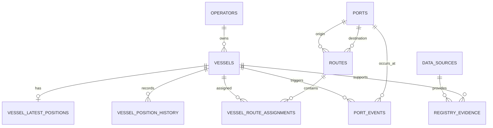

# 05 — Database Schema

## 1. Prinsip

- PostgreSQL 15+ dan PostGIS.
- UUID atau bigint dapat dipilih konsisten; baseline menggunakan UUID.
- Semua timestamp menggunakan UTC.
- Semua perubahan melalui migration.
- Data sumber dan data interpretasi dipisahkan.

## 2. Entity Relationship



## 3. Tabel Inti

### operators

| Kolom | Tipe | Catatan |
|---|---|---|
| id | uuid PK | |
| name | varchar(160) | unique normalized |
| slug | varchar(180) | unique |
| website_url | text nullable | |
| active | boolean | default true |
| created_at | timestamptz | |
| updated_at | timestamptz | |

### vessels

| Kolom | Tipe | Catatan |
|---|---|---|
| id | uuid PK | |
| operator_id | uuid FK nullable | |
| mmsi | varchar(9) | unique, digits only |
| imo | varchar(10) nullable | indexed |
| name | varchar(180) | |
| normalized_name | varchar(180) | indexed |
| call_sign | varchar(32) nullable | |
| vessel_category | varchar(40) | `RORO`, `ROPAX`, `FERRY_RORO` |
| verification_status | varchar(30) | `DRAFT`, `REVIEW`, `VERIFIED`, `REJECTED` |
| confidence_score | numeric(5,2) | 0–100 |
| active | boolean | |
| public_visible | boolean | |
| created_at | timestamptz | |
| updated_at | timestamptz | |

Constraints:

- MMSI tepat 9 digit.
- confidence 0–100.
- hanya `VERIFIED` dan `public_visible=true` yang tampil publik.

### vessel_latest_positions

| Kolom | Tipe | Catatan |
|---|---|---|
| vessel_id | uuid PK/FK | satu row per vessel |
| position | geography(Point,4326) | GiST index |
| latitude | numeric(9,6) | convenience |
| longitude | numeric(9,6) | convenience |
| sog_knots | numeric(6,2) nullable | |
| cog_degrees | numeric(6,2) nullable | 0–360 |
| heading_degrees | smallint nullable | 0–359 |
| nav_status | varchar(60) nullable | raw normalized |
| destination_text | varchar(200) nullable | user-entered AIS |
| source_timestamp | timestamptz | timestamp provider |
| received_at | timestamptz | worker receipt |
| provider_name | varchar(80) | |
| raw_message_id | varchar(120) nullable | dedupe aid |
| updated_at | timestamptz | |

### vessel_position_history

| Kolom | Tipe | Catatan |
|---|---|---|
| id | bigserial PK | write-heavy |
| vessel_id | uuid FK | indexed with recorded_at |
| position | geography(Point,4326) | optional GiST |
| latitude | numeric(9,6) | |
| longitude | numeric(9,6) | |
| sog_knots | numeric(6,2) nullable | |
| cog_degrees | numeric(6,2) nullable | |
| heading_degrees | smallint nullable | |
| source_timestamp | timestamptz | |
| received_at | timestamptz | |
| provider_name | varchar(80) | |
| created_at | timestamptz | |

Index utama:

```sql
CREATE INDEX idx_history_vessel_time
ON vessel_position_history (vessel_id, source_timestamp DESC);
```

### ports

| Kolom | Tipe | Catatan |
|---|---|---|
| id | uuid PK | |
| code | varchar(30) unique | internal |
| name | varchar(180) | |
| city_name | varchar(120) nullable | |
| province_name | varchar(120) nullable | |
| center_point | geography(Point,4326) | |
| geofence_geometry | geography(Polygon,4326) nullable | preferred |
| geofence_radius_m | integer nullable | fallback circle |
| verification_status | varchar(30) | |
| active | boolean | |
| created_at | timestamptz | |
| updated_at | timestamptz | |

### routes

| Kolom | Tipe | Catatan |
|---|---|---|
| id | uuid PK | |
| origin_port_id | uuid FK | |
| destination_port_id | uuid FK | |
| name | varchar(220) | |
| route_type | varchar(40) | `RORO`, `ROPAX` |
| bidirectional | boolean | |
| active | boolean | |
| created_at | timestamptz | |
| updated_at | timestamptz | |

Unique composite disarankan untuk pasangan port dan tipe.

### vessel_route_assignments

- id uuid PK
- vessel_id uuid FK
- route_id uuid FK
- valid_from date nullable
- valid_to date nullable
- source_id uuid nullable
- verification_status varchar(30)

### port_events

- id bigserial PK
- vessel_id uuid FK
- port_id uuid FK
- event_type varchar(30)
- event_time timestamptz
- detection_method varchar(30)
- confidence_score numeric(5,2)
- source_position_history_id bigint nullable
- metadata jsonb nullable

### data_sources

- id uuid PK
- name varchar(180)
- source_type varchar(40)
- url text nullable
- license_name varchar(120) nullable
- terms_url text nullable
- attribution_text text nullable
- access_method varchar(40)
- active boolean
- last_reviewed_at timestamptz nullable

### registry_evidence

- id uuid PK
- vessel_id uuid nullable
- port_id uuid nullable
- route_id uuid nullable
- data_source_id uuid FK
- evidence_type varchar(40)
- source_reference text
- observed_value jsonb
- confidence_score numeric(5,2)
- reviewed_by uuid nullable
- reviewed_at timestamptz nullable
- created_at timestamptz

### users

Laravel-compatible users table dengan role minimal:

- `admin`
- `reviewer`

### audit_logs

- id bigserial PK
- user_id uuid nullable
- action varchar(80)
- entity_type varchar(80)
- entity_id varchar(80)
- before_data jsonb nullable
- after_data jsonb nullable
- ip_address inet nullable
- created_at timestamptz

## 4. Retention

Baseline MVP:

- latest positions: tanpa expiry selama vessel aktif.
- raw history: 7 hari maksimum secara teknis, UI hanya 24 jam.
- agregat dapat dipertahankan lebih lama pada fase berikutnya.
- audit log: minimum 90 hari.

## 5. Sampling

Simpan history jika salah satu kondisi terpenuhi:

- waktu sejak sample terakhir >= 60 detik saat bergerak;
- waktu sejak sample terakhir >= 300 detik saat diam;
- jarak berubah >= 100 meter;
- nav status berubah;
- geofence transition terdeteksi.

## 6. Migration Rules

- Migration harus reversible bila memungkinkan.
- Index write-heavy dievaluasi dengan explain plan.
- Perubahan breaking memerlukan rencana migrasi.
- Seed data harus idempotent.
