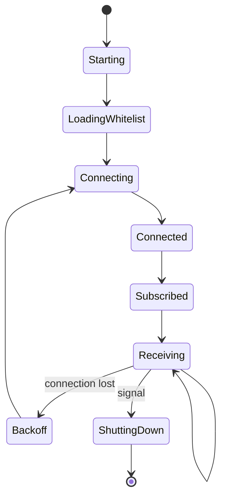

# 07 — AIS Worker Specification

## 1. Tujuan

Worker menjaga koneksi persisten ke provider AIS, menerima pesan, memvalidasi, menormalisasi, memfilter MMSI RoRo, dan mengirim posisi yang dapat diterima ke Laravel internal API.

## 2. Tanggung Jawab

- Membuka koneksi provider.
- Mengirim subscription filter.
- Memuat whitelist MMSI.
- Parsing dan validasi.
- Normalisasi unit dan status.
- Deduplication.
- Menolak stale dan impossible position.
- Delivery retry ke backend.
- Structured logging dan metrics.
- Graceful shutdown.

## 3. Bukan Tanggung Jawab Worker

- Menentukan vessel verification.
- Menjadi sumber business rule.
- Menulis langsung ke database.
- Menghitung final freshness publik.
- Menyimpan seluruh raw stream tanpa batas.

## 4. State Machine



## 5. Configuration

Environment variables:

```text
NODE_ENV
WORKER_ID
AIS_PROVIDER_URL
AIS_PROVIDER_API_KEY
AIS_BOUNDING_BOXES
BACKEND_INTERNAL_URL
BACKEND_INTERNAL_TOKEN
WHITELIST_REFRESH_SECONDS
MAX_MESSAGE_AGE_SECONDS
BACKOFF_MIN_MS
BACKOFF_MAX_MS
LOG_LEVEL
```

## 6. Validation Rules

- MMSI: 9 digit.
- Latitude: -90 sampai 90.
- Longitude: -180 sampai 180.
- Abaikan default invalid coordinates.
- SOG tidak negatif dan dibatasi reasonable maximum configurable.
- COG 0–360.
- Heading 0–359; nilai invalid menjadi null.
- Timestamp harus dapat diparse.
- Message age tidak melebihi threshold.

## 7. Whitelist

- Worker mengambil whitelist dari backend saat startup.
- Refresh berkala.
- Cache terakhir tetap digunakan bila backend sementara tidak tersedia.
- Version hash dicatat untuk observability.

## 8. Deduplication

Prioritas key:

1. provider message id;
2. kombinasi MMSI + source timestamp + coordinate;
3. cache TTL dedupe.

Duplicate tidak dikirim ulang.

## 9. Out-of-Order dan Stale

Worker menyimpan timestamp terbaru per MMSI dalam memory cache.

- Pesan lebih lama dari latest accepted diklasifikasikan out-of-order.
- Pesan sangat lama ditolak.
- Backend tetap melakukan validasi kedua.

## 10. Retry dan Backoff

### Provider Connection

Exponential backoff dengan jitter:

```text
1s, 2s, 4s, 8s ... maksimum 60s
```

Counter reset setelah koneksi stabil.

### Backend Delivery

- Retry terbatas untuk network error dan 5xx.
- Jangan retry 4xx validation error.
- Gunakan bounded in-memory queue pada MVP.
- Jika queue penuh, drop oldest atau newest sesuai ADR; baseline drop oldest dengan warning agar data terbaru diprioritaskan.

## 11. Logging

Log JSON minimum:

```json
{
  "level": "info",
  "event": "position_accepted",
  "worker_id": "worker-1",
  "mmsi": "525123456",
  "provider": "provider",
  "source_timestamp": "2026-08-01T12:00:00Z"
}
```

Jangan log API key, internal token, atau payload sensitif yang tidak diperlukan.

## 12. Metrics

- connection_state
- reconnect_total
- messages_received_total
- messages_invalid_total
- messages_unknown_mmsi_total
- messages_duplicate_total
- positions_delivered_total
- delivery_failures_total
- queue_depth
- last_message_timestamp
- whitelist_version

## 13. Health

Worker mengirim heartbeat setiap 30–60 detik.

Status:

- `HEALTHY`
- `DEGRADED`
- `DISCONNECTED`

## 14. Graceful Shutdown

Pada SIGTERM/SIGINT:

1. Stop menerima pesan baru.
2. Tutup WebSocket.
3. Flush bounded queue selama timeout.
4. Kirim heartbeat final.
5. Exit dengan code sesuai hasil.

## 15. Test Matrix

- valid position;
- invalid coordinate;
- unknown MMSI;
- duplicate;
- stale message;
- out-of-order;
- provider disconnect;
- backend timeout;
- backend 401;
- queue full;
- whitelist unavailable;
- graceful shutdown.
