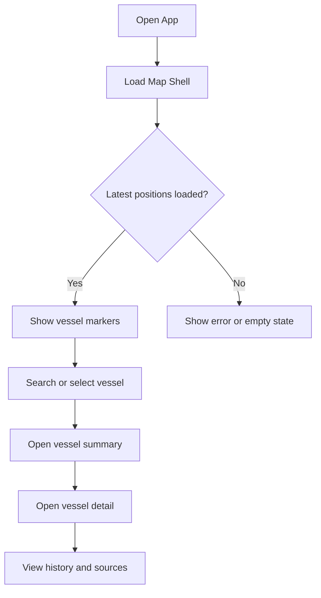
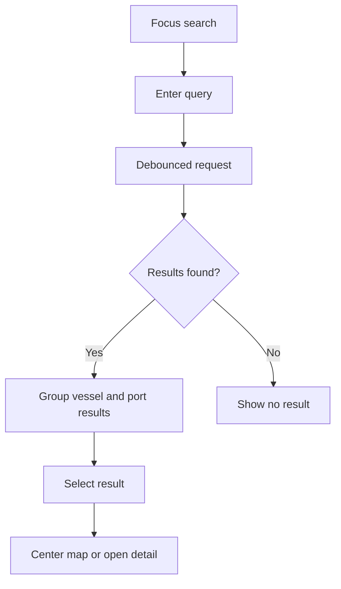
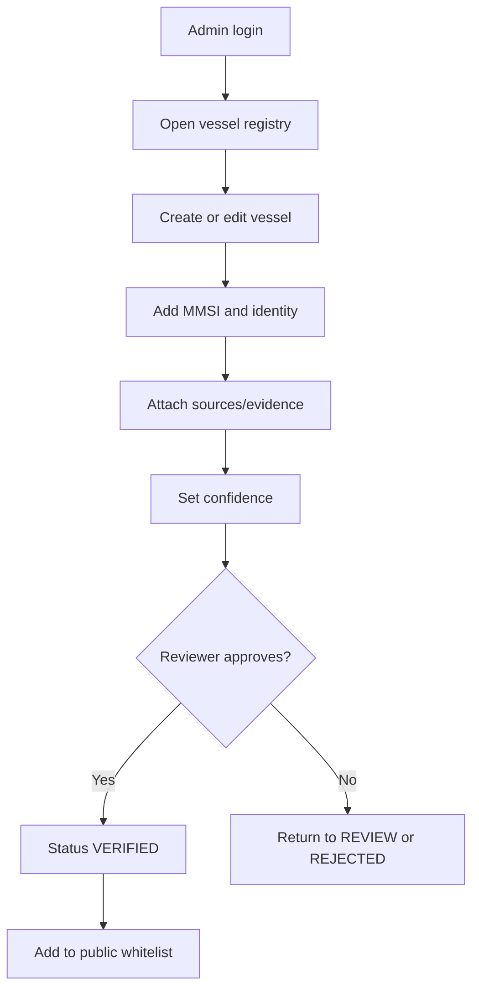
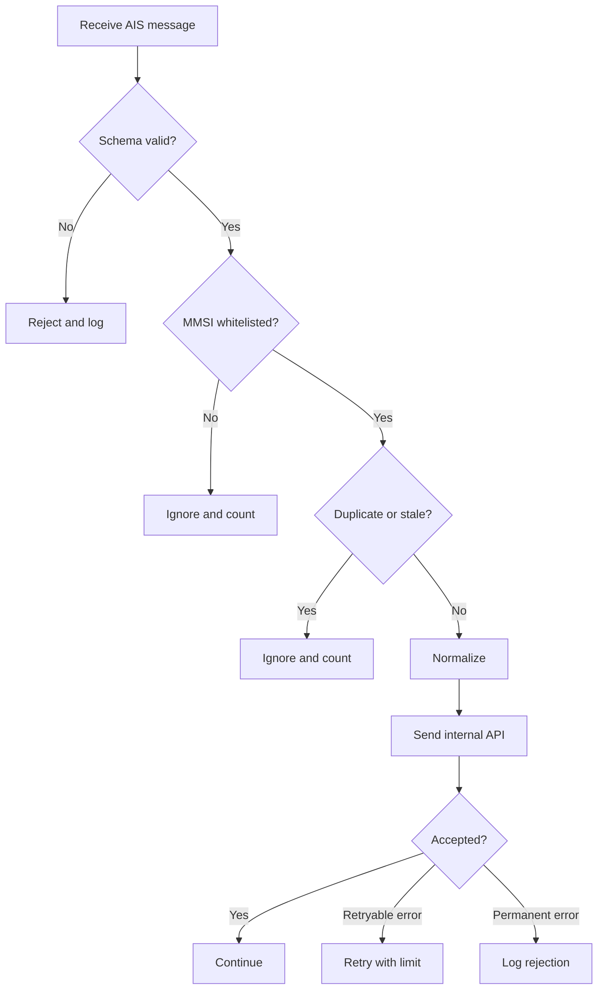

# 10 — User Flow

## 1. Public Map Flow

## 2. Search Flow

## 3. Admin Vessel Verification

## 4. Worker Data Flow

## 5. Port Geofence Flow

- Position diterima.
- Backend mencari port candidate dalam radius tertentu.
- Sistem membandingkan state sebelumnya.
- Jika transisi memenuhi dwell time, event dibuat.
- UI dapat menampilkan event sebagai hasil deteksi sistem.
